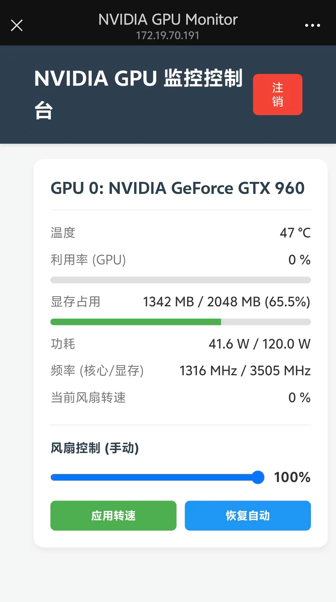

# NVIDIA GPU Web Monitor

这是一个本地网页程序，用于监控 NVIDIA 显卡的状态并手动控制风扇转速。



## 技术栈
- 后端：Python、FastAPI、Uvicorn、nvidia-ml-py
- 前端：原生 HTML、CSS、JavaScript（无复杂框架）
- 环境管理：`uv` (推荐)

## 特性
- 实时监控 GPU 名称、温度、利用率、显存、功耗、频率、风扇转速。
- 在页面直观的滑动条中将风扇转速设定为 20%~100% 之间，并随时恢复到自动 (Auto) 模式。
- 基于随机生成的 `Auth Key` 的简单认证系统，保障本地/局域网调用的基本安全。

## 安装与运行

### 使用 `uv`（推荐）

1. **初始化并安装依赖**
   ```bash
   uv venv
   source .venv/bin/activate
   uv pip install fastapi uvicorn nvidia-ml-py pydantic
   ```
   *(如果 `uv pip` 在你的系统上报错，可以尝试使用标准 `pip`)*

2. **运行程序**
   ```bash
   uvicorn main:app --host 0.0.0.0 --port 8000
   ```

### 使用标准 `pip`（备选）

```bash
python3 -m venv .venv
source .venv/bin/activate
pip install fastapi uvicorn nvidia-ml-py pydantic
python3 main.py
# 或: uvicorn main:app --host 0.0.0.0 --port 8000
```

## 认证 (Auth Key)

为了防止局域网内其他人随意控制你的 GPU 风扇，程序实现了基于 Key 的简单登录：
1. **首次运行**时，后端会在根目录自动生成 `config.json`，并创建一个长度为 32 字符的随机 `auth_key`。
2. 启动控制台会打印出**一键登录 URL**，如 `http://localhost:8000/?key=xxxxxx`。
3. 复制该链接在浏览器中打开，前端会自动保存 Key，以后打开即可直接进入 Dashboard。
4. 如果更换浏览器或清理了缓存，可以在页面的登录框中手动粘贴该 Key。

## 注意事项

- **Linux 风扇控制权限**：在 Linux 系统中，使用 NVML (nvidia-ml-py) 修改风扇转速通常需要 **root 权限**。如果你发现点击设置风扇时提示失败，请尝试使用 `sudo .venv/bin/python main.py` 运行后端。
- **不支持控制**：部分笔记本显卡（如 Max-Q 系列）或服务器算力卡可能在硬件和驱动层面本身不支持通过 NVML 手动控制风扇转速。
- 当你强制设定了风扇转速后，显卡的风扇将保持该固定转速，不再随温度自动调节。请**注意硬件温度**以免过热损坏。点击“恢复自动”按钮可交还控制权给驱动程序。